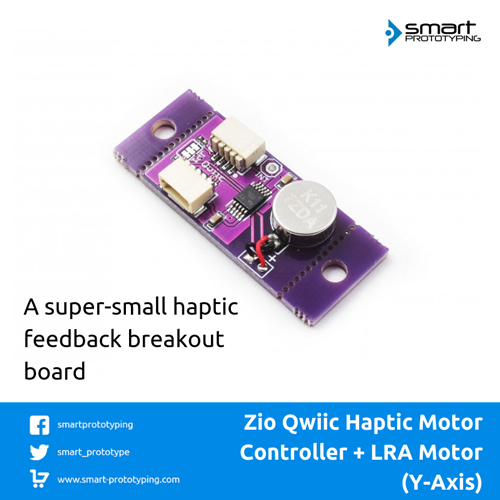

# Qwiic Haptic Motor Controller LRA Motor Round G0832012 (Y-Axis)

> This product can be available for purchase [here](https://www.smart-prototyping.com/Zio-Qwiic-Haptic-Motor-Controller-Motor-y-axis-G0832012).

#### Description

We are making your life easier, this is the first Motor controller IC (DRV2605L) + LRA motor (G0832012) combination module on the marketing, we make it tiny and with two Qwiic connectors on the board, no need soldering, just plugin and have fun!

To make the board smaller, you can use pliers to remove the tab bar by following the continuously hole line. 

About the LRA motor (Y-Axis, G0832012)
This is a general construction LRA vibration motor, the Y-axis type. Those readers familiar with audio engineering will note that the voice coil drive is very similar to that loudspeaker. However, instead of a cone that generates sound pressure waves, there is a mass that generates vibrations.

> Check the source documentation [here](https://www.precisionmicrodrives.com/vibration-motors/linear-resonant-actuators-lras/).

#### Specification

* Motor Driver IC: DRV2605L
* Y-Axis Motor Manufacture Number:
* IC:D RV2605L
* I2C address: 0x5A
* Dimension: 35.9 x 14.4mm
* Weight: 2.9g

#### Links

* [PCB Source file](https://github.com/ZIOCC/Qwiic-Haptic-Motor-Controller-LRA-motor-y-axis-G0832012/tree/master/EAGLE)
* [PCB Schematic](https://github.com/ZIOCC/Qwiic-Haptic-Motor-Controller-LRA-motor-y-axis-G0832012/blob/master/Haptic%20Motor%20driver%20board%20%2B%20LRA%20y%20axis%20G0832012.pdf)
* [Demo Code (Adafruit DRV2605 Library)](https://github.com/adafruit/Adafruit_DRV2605_Library)
* [DRV2605L Datasheet](https://www.smart-prototyping.com/image/data/2_components/sensors/101802DRV2605L%20Haptic%20Driver/DRV2605.pdf)

###### About Zio
> Zio is a new line of open sourced, compact, and grid layout boards, fully integrated for Arduino and Qwiic ecosystem. Designed ideally for wearables, robotics, small-space limitations or other on the go projects. Check out other awesome Zio products [here](https://www.smart-prototyping.com/Zio).
